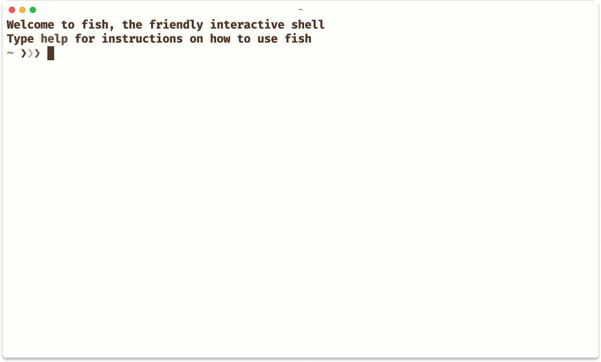

# monotropic coffee theme to Hyper.app

<a href="https://github.com/avelino/monotropic-theme-vscode"></a>

A port of the [monotropic](https://github.com/avelino/monotropic-theme-vscode) of **coffee** color scheme for [Hyper.app](https://hyper.is/)



## Installation

1. Open HyperTerm's preferences by pressing `Cmd + ,`.
2. Find and Update the plugins array to include `hyper-monotropic-coffee`:

  ```js
  plugins: [  
    'hyper-monotropic-coffee'
  ],
  ```

3. Reload HyperTerm by pressing `Cmd + Shft + R`
